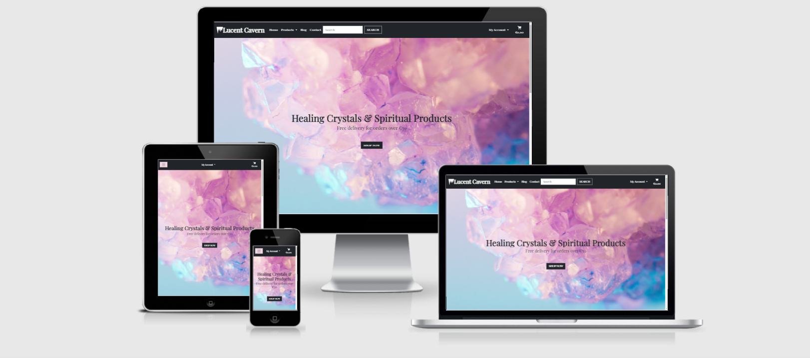
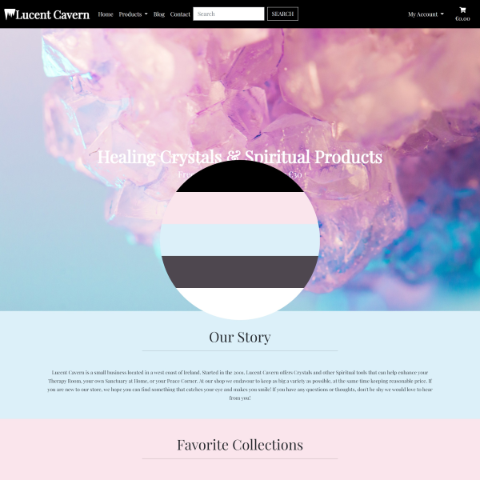
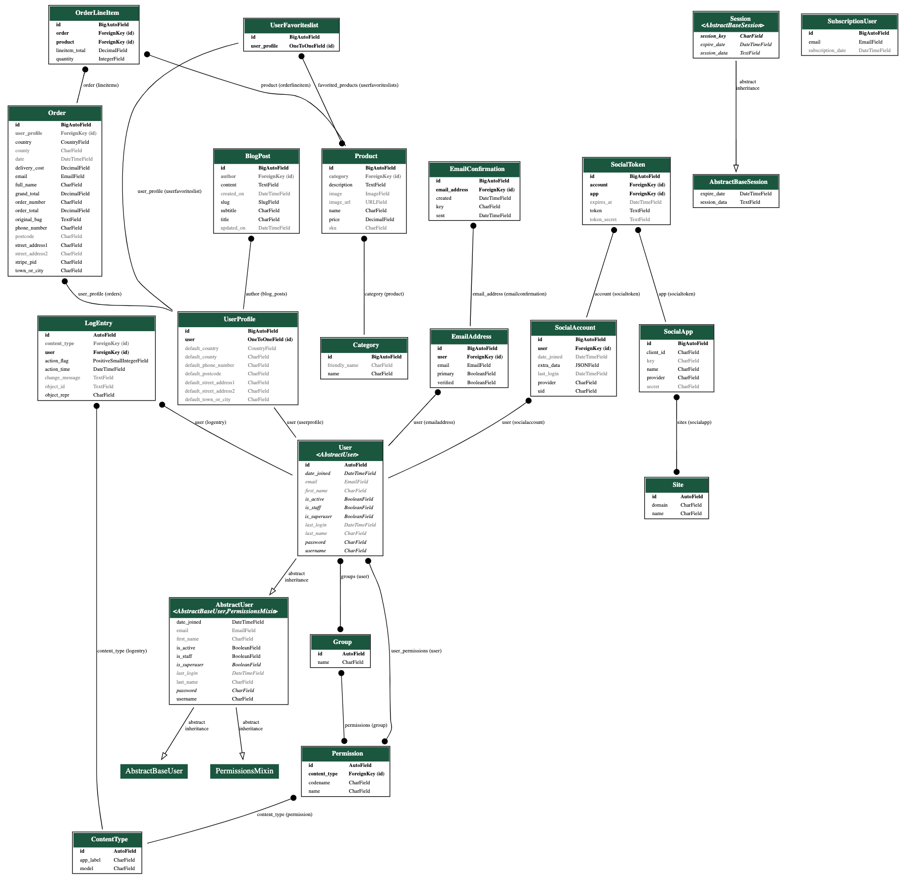

# [Lucent Cavern](lucent-cavern.herokuapp.com)

This website is my final Milestone project in Code Institute. Project contains the use of  HTML, CSS, JavaScript, Django, Python, and a relational database. Website hosted on Heroku. Static and media files stored on an S3 Cloud storage from AWS. Project is connected to Stripe's payment processing platform.

## Contents
- [UX](#ux)
    - [User Stories](#user-stories)
    - [Design](#design)
    - [Wireframes](#wireframes)

- [Features](#features)
    - [Current Features](#current-features)
    - [Future Features](#future-features)

- [Database](#database)
	- [Database Schema](#database-schema)
    - [Database structure](#structure)

- [Testing](#testing)
	- [Validation](#validation)

- [Technologies](#technologies)
    - [Languages](#languages)
    - [Libraries and Frameworks](#libraries-and-frameworks)
    - [Databases](#databases)
    - [Tools](#tools)

- [Deployment](#deployment)
	- [Local Deployment](#local-deployment)
    - [To Heroku](#to-heroku)

- [Credits](#credits)
    - [Media](#media)
    - [Content](#content)
    - [Acknowledgements](#acknowledgements)
    

# UX

## User Stories

### As a client I expect:

- A website were I can shop all products and make easy transaction.
- A website to have optimal layout and attractive design.
- A website to be intuitive, easy to navigate so that I would be able to find what I need as fast as possible.
- To find information about products easily.
- To easily sort products on a page and be able to search for a product by using search word.
- To be able to add products to the list where later I can find them without scrolling thru all production.
- To be able to find contact information and social media links for more info. 
- To be able to register, login easily and take less steps as possible.
- To be able to make a purchase with minimal amount of steps.
- To be able to get a confirmation after purchase is made. Be provided with details on a website and confirmation email.
- To be able to read store's Blog, have an ability to subscribe for a newsletter.
- To be able to use website on any device: laptop, tablet or mobile phone.
- To be informed after each request I make, like form completion, registration, login, log out and else.
- To be able to update/change my personal information, like an address or contact number.

### As a owner I expect:

- To be able to add products, edit their details or delete them.
- To be able to add Blog posts, edit them or delete

## Design

### Theme

I wanted to create a website that would create a feeling that you are in a lucent cavern. Main image on a home page is a base for all website's colours and backgrounds. Main goal of light colours is to provide lightweight and modern site.

### Colours

Colours taken from home image, to match whole website.

### Typography

Main font family is  [Playfair Display](https://fonts.google.com/specimen/Playfair+Display) from Google Fonts.

## Wireframes
Wireframes were created by hand. They look simple and not very detailed, a bit different from final look because they were created before I started my project. Personally for me it's easier to put everything into places when project is in progress already, details like buttons forms and other elements.

#wireframes links#

# Features

<h2>
:small_red_triangle_down: Current Features
<h2>

 ### Shared features:
 
 - Fixed Navbar:
	 - Brand name
	 - Home
	 - Products (links to categories)
	 - Blog
	 - Contact (link to the footer's Contact Us section)
	 - Search Bar with button for user to search product by word links to products page with search results
	 - My Account dropdown menu links to product management (admin only), profile (registered users), favorites list ( registered users), log out (registered users), registered, login)
	 - Cart icon to link user to their shopping bag page

- Toasts with messages for Success, Error, Info, Warning. Three main important messages:
	-  If user adds item to shopping bag, toast success provides shopping bag details table.
	-  If user adds/removes product to/from Favorites list, success message provides info on that action.
	- After user successfully completes order success toast appears with information and order number.

- Footer:
	- Lucent Cavern address section for physical store
	- Contact Us section with email link, working hours and phone number
	- Follow Us section with social media links
	- Copyright

### Individual features:

- My Favorites page (registered users only) contains:

	- Header Favorites list
	- Card element for each item in a Favorites list:
		- Product Image, name, price, category, edit/delete product icon buttons (admin only)

- Blog page contains:

	- Our Blog header
	- Blog posts list with cards:
		- Post title
		- Author, date
		- Content
		- Read more button which links to individual post details

- Blog post details page contains:

	- Post title
	- Subtitle
	- Author
	- Date when published
	- Blog post content
	- Back button which links user to Blog page 

- Home page contains:

	- Announcement section describing  website's content, button to link user to All Products page
	- Our Story section
	- Favorite Collections sections for users to check favorite categories - Raw Crystals, Jewellery, Salt Lamps. Added images to catch eye. Added button to link to All Products page.
	- Subscribe section contains  form where user can input their email address and subscribe a newsletter. Added submit button.

- Products page contains:

	- Two headers:
		- Products
		- Category name
	- Link to all products page, products count
	- Select dropdown to let users tot sort products (asc or desc) by price, name or category.
	- Product card for each product with product image, product name, price and category. Contains icon buttons which  allows admin only, edit product details or delete product
	
- Product detail page contains:

	- Product image
	- Product name
	- Product category
	- Heart icon button (registered users only), to add/remove product to user's Favourites list
	- Contains icon buttons which  allows admin only, edit product details or delete product
	- Description
	- Form for user to select product quantity
	- Continue Shopping button which links to all Products page
	- Add to bag button, which puts item to the shopping bag

- Edit Product page (admin only) contains:

	- Header for Product Management
	- Header for Edit Product
	- Form for:
		- Category options, Sku, Product name, description, price, Image URL, Choose File button to upload image
	- Cancel button to cancel Product Editing
	- Update Product button to update product details and save them

- Add Product page (admin only) contains:

	- Header for Product Management
	- Header for Edit Product
	- Form for:
		- Category options, Sku, Product name, description, price, Image URL, Choose File button to upload image
	- Cancel button to cancel Product Add
	- Add Product button to add product to DB

- Register page contains:

	- Header
	- Paragraph with link to login page
	- Form to input email, username, password
	- Button to Sign up
	- Button Back to Login which links to login page
	
- Login page contains:

	- Header
	- Paragraph with link to Register page
	- Form to input username, password
	- Button Home to link user to Home page
	- Button Sign In to let user login
	- Forgot Password link, to link user to the Reset Password page

- Password reset page contains:

	- Paragraph with instructions
	- Input field for Email address
	- Back to Login button
	- Reset my Password button
	
- Shopping Bag page contains:

	- Table with product details:
		- Button on image's left top corner to delete product from shopping bag
		- Product image
		- Name, price
		- Quantity input 
		- Update button, to update product quantity
		- Price for each item
		- Product subtotal
	- Bag Total
	- Delivery costs
	- Grand Total
	- Paragraph with sum left to spent for free delivery. If shopping bag total less than 30 euro.
	- Continue Shopping button to link user to Products page
	- Secure Checkout button to link user to the Checkout page

- Checkout page contains:

	- Header
	- Order list count
	- Item image, name, quantity subtotal
	- Total sum
	- Delivery costs if any
	- Grand Total
	- Form for personal details:
		- Name, Email Address
	- Form for delivery details:
		- Phone number, address
	-	Check field for registered user save details
	-	Stripe input element for user's card details
	-	Change Bag button, to link user to shopping if changes needs to made
	-	Complete Order button, to confirm user's order/transaction sends user to checkout success page and triggers email with order details to be sent to user

- Checkout Success page contains:

	- Header
	- Paragraph
	- Container with order details:
		- Date
		- Items, their quantity, each price
		- Delivery Information -  Full Name, Address, Phone Number
		-  Billing Information - Total, Delivery costs,
		- Grand Total
	- Button to link users to Products page
	- Back to Profile button, to link user back to the Profile if user came from there

- My Profile page contains:
	- Header My Profile
	- Table with Personal Order History:
		- Oder number which links to checkout success page where user could see order details.
		- Date
		- Items, their quantity
		- Order Total
	- Personal Default Delivery Information form:
		- Phone Number, Address
	- Update Information button to update form with new details

- Log Out page (registered users only) contains:

	- Header Sign Out
	- Question Paragraph
	- Cancel button
	- Sign Out button to confirm action

<h2 style="display:inline-block">
Future Features
<h2>

- Provide ability for user to leave a feedback for product, rate it.
- Provide ability for user login with social media account.

# Database

- For Development I used SQlite3 database which provided by Django. After deployment to Heroku database was switched to PostgreSQL.

## Database Schema

<h2 style="display:inline-block">
Structure
<h2>

### Category model

Field Name | Field Type | Requirements
------------- | ------------- | -------------
name | CharField() | max_length=254
friendly_name | CharField() | max_length=254, null=True, blank=True

### Product model

Field Name | Field Type | Requirements
------------- | ------------- | -------------
category | ForeignKey() | 'Category', null=True, blank=True, on_delete=models.SET_NULL
sku | CharField() | max_length=254, null=True, blank=True
name | CharField() | max_length=254, 
description | TextField() | 
price | DecimalField() | max_digits=6, decimal_places=2
image_url | URLField() | max_length=1024, null=True, blank=True
image | ImageField() | null=True, blank=True

### BlogPost model

Field Name | Field Type | Requirements
------------- | ------------- | -------------
author | ForeignKey() | UserProfile, on_delete=models.CASCADE, related_name='blog_posts', null=False, blank=Trueblank=True, on_delete=models.SET_NULL
title | CharField() | max_length=120, null=True, blank=False 
subtitle | CharField() | max_length=180, null=True, blank=False 
content | TextField() |  
slug | SlugField() | unique=True, max_length=250, default=None
created_on | DateTimeField() | auto_now_add=True, null=False
updated_on | DateTimeField() | auto_now=True, null=False

### Order model

Field Name | Field Type | Requirements
------------- | ------------- | -------------
order_number | CharField() | max_length=32, null=False, editable=False
user_profile | ForeignKey() | UserProfile, on_delete=models.SET_NULL, null=True, blank=True, related_name='orders' 
full_name | CharField() | max_length=50, null=False, blank=False
email | EmailField() | max_length=254, null=False, blank=False
phone_number | CharField() | max_length=20, null=False, blank=False
country | CountryField() | blank_label='Country *', null=False, blank=False 
postcode | CharField() | max_length=20, null=True, blank=True
town_or_city | CharField() | max_length=40, null=False, blank=False 
street_address1 | CharField() | max_length=80, null=False, blank=False
street_address2 | CharField() | max_length=80, null=True, blank=True
county | CharField() | max_length=80, null=True, blank=True 
date | DateTimeField() | auto_now_add=True 
delivery_cost | DecimalField() | max_digits=6, decimal_places=2, null=False, default=0
order_total | DecimalField() | max_digits=10, decimal_places=2, null=False, default=0 
grand_total | DecimalField() | max_digits=10, decimal_places=2, null=False, default=0
original_bag | TextField() | null=False, blank=False, default=''
stripe_pid | CharField() | max_length=254, null=False, blank=False, default=''

### OrderLineItem model

Field Name | Field Type | Requirements
------------- | ------------- | -------------
order | ForeignKey() | Order, null=False, blank=False, on_delete=models.CASCADE, related_name='lineitems'
product | ForeignKey() | Product, null=False, blank=False, on_delete=models.CASCADE
quantity | IntegerField() | null=False, blank=False, default=0
lineitem_total | DecimalField() | max_digits=6, decimal_places=2, null=False, blank=False, editable=False

### UserFavoritesList model

Field Name | Field Type | Requirements
------------- | ------------- | -------------
user_profile | OneToOneField() | UserProfile, on_delete=models.CASCADE, null=False, blank=False
favorited_products | ManyToManyField() | Product, related_name='userfavoriteslists'

### UserProfile model

Field Name | Field Type | Requirements
------------- | ------------- | -------------
user  | OneToOneField()  |  User, on_delete=models.CASCADE
default_phone_number  |  CharField()  |  max_length=20, null=True, blank=True
default_street_address1  | CharField() |  max_length=80, null=True, blank=True
default_street_address2  |  CharField()  |  max_length=80, null=True, blank=True
default_town_or_city | CharField() | max_length=40, null=True, blank=True
default_county | CharField() | max_length=80, null=True, blank=True
default_postcode |  CharField() | max_length=20, null=True, blank=True
default_country | CountryField()  |  blank_label='Country', null=True, blank=True

### SubscriptionUser model

Field Name | Field Type | Requirements
------------- | ------------- | -------------
email | EmailField() | default=False, null=False, blank=False
subscription_date | DateTimeField() | auto_now_add=True

# Testing

<h2 style="display:inline-block">
Validation
<h2>

### Results

Validator | Result 
------------- | ------------- 
[W3C validator HTML](https://validator.w3.org/) | :heavy_check_mark: 
[W3C validator JIGSAW CSS](https://jigsaw.w3.org/css-validator/) | :heavy_check_mark: (by direct CSS input)
[JSHint validator](https://jshint.com/) | :heavy_check_mark:
[PEP8 validator](http://pep8online.com/) | :heavy_check_mark:

# Technologies

## Languages

- HTML5
- CSS3
- JavaScript
- Python3

## Libraries and Frameworks

- Django3
- Bootstrap (V.5)
- jQuery
- Font Awesome (V.5)
- Google Fonts

## Databases

- SQlite3
- PostgreSQL

## Tools

- Gitpod
- Github and Git
- Heroku
- Stripe
- AmazonS3

# Deployment

<h2 style="display:inline-block">
Local Deployment
<h2>

1.  Log in to your  Gitpod account 
2.  Clone this project repository from GitHub
    -   Go to my [LuucentCavern repository](https://github.com/ErnestaMajute/lucentCavern) 
 3. Add Gitpod browser extension for Chrome:
    -   Go to  [GitPod Chrome Browser Extension](https://chrome.google.com/webstore/detail/gitpod-online-ide/dodmmooeoklaejobgleioelladacbeki)
  4.  If you  installed the extension you should view a green Gitpod button on the top right corner of page. Next to Clone or Download button. 
  5. When clicked this button will allow you to open this repository directly in Gitpod.
6.  The following environment variables needs to be set:

KEY | VALUE
------------- | ------------- | 
DATABASE_URL | <DATABASE_URL>
AWS_ACCESS_KEY_ID | <AWS_ACCESS_KEY_ID>
AWS_SECRET_ACCESS_KEY | <AWS_SECRET_ACCESS_KEY>
EMAIL_HOST_PASSWORD | <EMAIL_HOST_PASSWORD>
EMAIL_HOST_USER | <EMAIL_HOST_USER>
SECRET_KEY | <SECRET_KEY>
STRIPE_PUBLIC_KEY | <STRIPE_PUBLIC_KEY>
STRIPE_SECRET_KEY | <STRIPE_SECRET_KEY>
STRIPE_WH_SECRET | <STRIPE_WH_SECRET>
USE_AWS | True

7.  Download all the dependencies to run this project and listed in the  **requirements.txt**  by running command **pip3 install -r requirement.txt**.
8.  Create a local development server. In the workspace run the following command  **python3 manage.py runserver** . Now you should have a Gitpod link to the deployed app.

<h2 style="display:inline-block">
To Heroku
<h2>

This [LucentCavern](https://lucent-cavern.herokuapp.com/) app was deployed through Heroku using the master branch of my GitHub [LuucentCavern repository](https://github.com/ErnestaMajute/lucentCavern). Link To Deplyed app also can be foud on a very top of page.

1. Install **gunicorn** to run the application on Heroku by running command **sudo pip3 install gunicorn**
2. Install **pycopg2** to connect to PostgreSQL by running command  **sudo pip3 install psycopg2**
3. Create a **requirements.txt** file by running command **sudo pip3 freeze --local > requirements.txt**
4. Create a new Heroku application by clicking **New** after **Create New App**. Give a name to your app and click **Create app**
5. Install PostgreSQL add-on by running command **heroku addons:create heroku-postgresql:hobby-dev**
6. Create a Procfile by running command **echo web: gunicorn lucent-cavern.wsgi:application > Procfile**
7. Following config variables needs to be set:

KEY | VALUE
------------- | ------------- | 
DATABASE_URL | <DATABASE_URL>
AWS_ACCESS_KEY_ID | <AWS_ACCESS_KEY_ID>
AWS_SECRET_ACCESS_KEY | <AWS_SECRET_ACCESS_KEY>
EMAIL_HOST_PASSWORD | <EMAIL_HOST_PASSWORD>
EMAIL_HOST_USER | <EMAIL_HOST_USER>
SECRET_KEY | <SECRET_KEY>
STRIPE_PUBLIC_KEY | <STRIPE_PUBLIC_KEY>
STRIPE_SECRET_KEY | <STRIPE_SECRET_KEY>
STRIPE_WH_SECRET | <STRIPE_WH_SECRET>
USE_AWS | True

8. On Heroku in a Deploy page, choose **Connect Github** and **Enable Automatic Deployment** and new commits will be automaticly deployed to your neew Heroku application.

# Credits

### Media

- Images and background used for this project were found on:
	-  [Pexels](https://www.pexels.com)
	- [PxHere](https://pxhere.com/)
	- [Unsplash](https://unsplash.com/)
	- [Pixabay](https://pixabay.com/)
	- Responsive Image from [Am I Responsive?](http://ami.responsivedesign.is/)
	- Image with colour palette from [Coolors](https://coolors.co/image-picker)

### Content

Project developed by following Boutique Ado(Code Institute) mini project lessons. I added comments to pieces which were taken and modified to fit my project functionality. Apps like: Shopping Bag, Checkout, Products, Profiles.

- Blog App was created with help from [Django central](https://djangocentral.com/building-a-blog-application-with-django/).
- [Button on Image Idea](https://www.w3schools.com/howto/howto_css_button_on_image.asp)
- [Ideas for Favorites](https://stackoverflow.com/questions/61561263/django-wishlist-feature-implementing)
- Ideas for Newsletter Subscription found on Slack
- [Style guide for Python Code](https://www.python.org/dev/peps/pep-0008/#code-lay-out)
- [README dropdown header styling](https://stackoverflow.com/questions/47392245/show-dropdown-area-expandable-area-with-code-in-markdown-file)
- [README dropdown](https://gist.github.com/citrusui/07978f14b11adada364ff901e27c7f61#file-dropdown-md)

### Acknowledgements
I want to say huge thanks to my mentor Reuben Ferrante, who guided me through all Code Institute Course. Thankful for his patience, professionalism and good words which motivated me in past months.
As well thanks to Code Institute Tutors who helped me to deal with all issues. And somehow taught me - to ask for help when I need it. Before, I had issues with that :)
Thanks to all Code Institute's team for skills, knowledge, support, motivation and a chance to be a student again.
